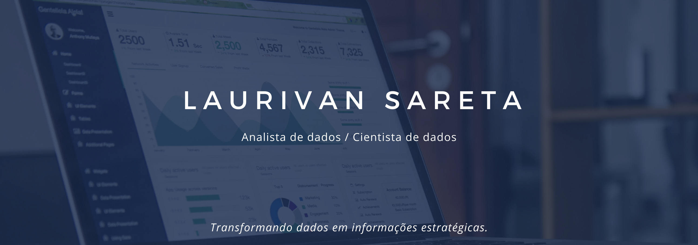

# **Seja Bem vindo e bem vinda!** 👋 

## **Me chamo** 
### 

## Quem sou eu? 
* 📈 Atualmente estou trabalhando na [Cycle](http://cycletec.com.br/) como Cientista de dados e com o projeto [**Sua empresa Orientada a Dados**](https://drive.google.com/file/d/1LzSJQ618fsPpttAhEe-HJPSdmP6wX_yW/view)
* 📊 Trabalho e tenho experiência como Cientista de dados e Analista de BI.
* 🎓 Sou Bacharel em Ciência da Computação - UFFS e Aluno da Comunidade DS.
* 👩‍💻 Estou me especializando na área de Ciência de dados, aprimorando minhas habilidades e conhecimentos.

## Habilidades, Linguagens e Ferramentas 👩‍💻

| ⭐⭐⭐⭐⭐ | ⭐⭐⭐⭐ | ⭐⭐⭐ | ⭐⭐ | ⭐ |
| ------ | ------ | ------ | ------ | ------ |
| Data Visualization |Docker|NodeJS| R ||
|SQL|HTML, CSS e Javascript|Angular|||
|Pentaho|Bootstrap|Ionic|||
|Git/SVN |MDX||||
|Python|||||
|Machine Learning|||||
|Pandas, scikit learning, seaborn, surprise, selenium |||||
|Linux, AWS, GCP, VPS, Digital Ocean, Heroku|||||
|ETL|||||
|Data Warehouse|||||
|Power BI|||||
|Delphi|||||

## Me encontre pelo 🌎

*  [Site]( https://laurivansareta.github.io/ )
*  [Linkedin]( https://www.linkedin.com/in/laurivan-sareta/ )
*  [Instagram]( https://www.instagram.com/laurivansareta/)
*  [Blog]( https://laurivansareta.medium.com/ )

 ___

# **Meus projetos**

## **Meus projetos Data Science**
* [**Projeto de Previsão das vendas das lojas Rossmann**](https://github.com/laurivansareta/previsao-vendas-lojas-rossmann)
    Este projeto tem como objetivo gerar insights e prever o faturamento de uma rede de farmácias chamada Rossmann.
  
* [**Programa de fidelidade Insiders**](https://github.com/laurivansareta/insiders_clustering)
  Este projeto tem como objetivo descobrir os melhores clientes para participar de um programa de fidelidade.

* [**Sistema de Recomendação para Cross-selling de Seguros**](https://github.com/laurivansareta/Health-Insurance-Ranking)
  Este projeto visa ordenar uma lista de clientes em potencial por pontuação de propensão para adquirir seguro de carro.

* [**Segmentação de Clientes**](https://github.com/laurivansareta/segmentacao-clientes)
  Este projeto tem finalidade de segmentar cliente usando a metodologia RFM e algoritmos de machine learning para classificar os clientes por segmentos.

* [**Recomendação de Recomendação de Filmes**](https://github.com/laurivansareta/sistema-recomendacao-movielens)
    Este projeto tem como objetivo de gerar recomendação utilizando dados do Movielens, e posteriormente usar os insights para desenvolver outros sistemas de recomendação.
  
## Projetos Diversos 🚧
* **Docker**
    * [SFTP com Docker](https://github.com/laurivansareta/sftp-docker)

## Projetos de hands-on cursos 📖

Ao longo da jornada de aprendizado percebi que nada melhor do que por a mão na massa quando estou aprendendo algo.
Tendo isso em vista organizei os repositórios de desenvolvimento agrupados por categoria.

* **Formação Data Science - Alura**
    * [Data Science: Primeiros passos](https://github.com/laurivansareta/introducao-a-data-science)
    * [Python Pandas: Tratando e analisando dados](https://github.com/laurivansareta/introducao-python-pandas)
    * [Estatística com Python parte 1: Frequências e Medidas](https://github.com/laurivansareta/estatistica-distribuicoes-e-medidas)

* **Formação Python para Data Science - Alura**
    * [Scraping com Python: Coleta de dados na web](https://github.com/laurivansareta/web-scraping-data-science-python)

* **Formação Angular (Formação anterior) - Alura** [link alura](https://cursos.alura.com.br/formacao-angular-v2398)
    * [Angular parte 1: Fundamentos](https://github.com/laurivansareta/alurapic)

* **Formação Node.js com Express**
    * [NodeJS: API com Express e MySQL](https://github.com/laurivansareta/node-rest-api) 
        O curso originalmente utiliza MySQL, porém fiz usando conexão com PostgreSQL.
    * [NodeJS: Streaming de dados e Repositório](https://github.com/laurivansareta/nodejs-streaming-dados)
       

